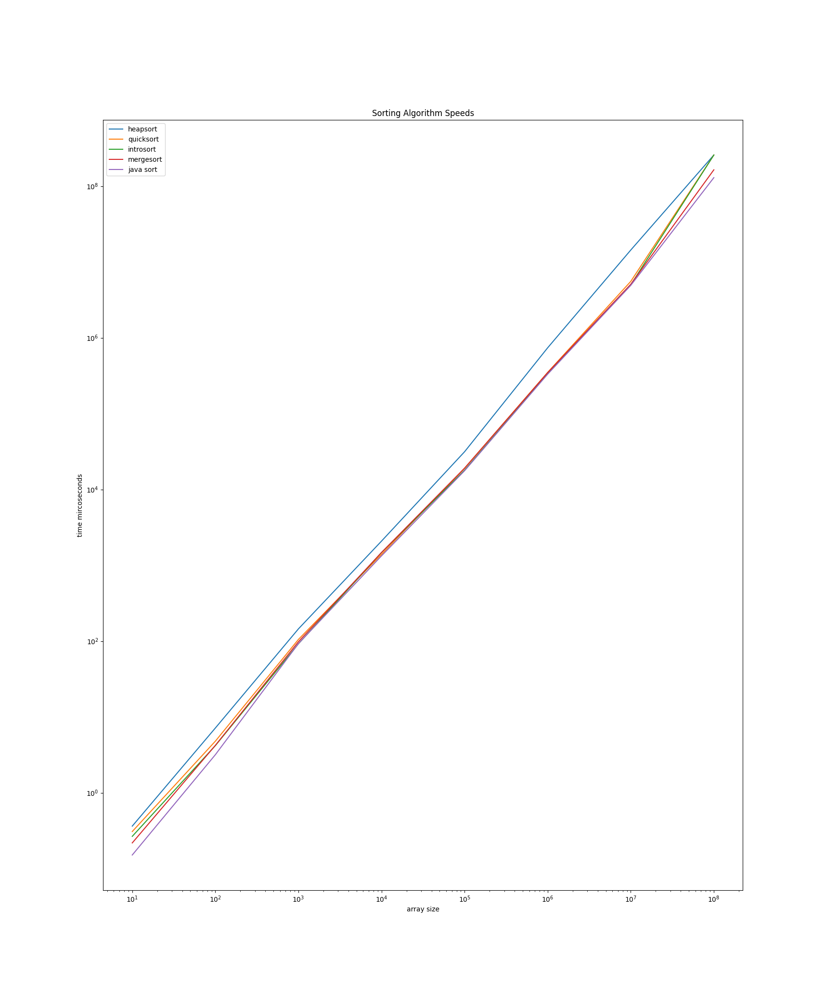

Benchmarking
============

For the benchmarking, I was not able to do it for an array of 1 billion elements because the RAM usage that would take
is too much (Integer class takes 16 bytes. 16 bytes * 1,000,000,000 = 16 gb only for the values.
Another billion pointers are needed. This would take 8 bytes * 10 ^ 9 = 8 gb resulting in at least 24 gb needed.
Another large amount might be needed for the stack, however that depends on if the algorithm is recursive or not).
I decided to graph the results of the benchmarking with [matplotlib with python](resources/graph.py).
Benchmarking the code took way too long, over 5 hours. Part of the reason was debugging and the other part was that
the library used for benchmarking is *very thorough* and some of the sorting algorithms took a few seconds to sort.
The [results](resources/results.csv) of this can be found here:

In my original code without tuning any of the parameters for introsort, Java's ``Collections.sort()`` was slightly faster.
Therefore, I might try tuning the parameters in order to see if I can beat Java's speed. The comparison isn't completely
fair because Java uses a stable sorting algorithm (Tim Sort) and introsort is unstable, however it is most likely the only
way I can get code faster than Java because their implementation of Tim Sort has years of experience.
After a few attempts, I managed to get my introsort algorithm to *barely* work better than Java's Collections.sort().
I think the reason my sorting algorithm is a lot slower on arrays of size of 10 is because Java's sorting algorithm 
turns the Collection into an array instead of keeping it as a collection. 
This is beneficial as it allows it to not have to deal with the ``list.set()`` and ``list.get()``.
Those two functions both have code to make sure it is allowed and are overall slower than using ``array[i]``.

Algorithms Implemented
======================

Most of the instructions on implementing the algorithms came from wikipedia. Heapsort was implemented using the same
code as the last assignment. I will stick a link to all the sources I used for each algorithm.
Of these algorithms the most interesting ones are probably quick sort as the way you partition the array has a large impact
on the performance.
The way I partition it, is by finding the median and using that to partition it. Finding the median of a large
array is rather expensive, so I use a method of [approximating it](https://andrewgrex.medium.com/the-ninther-approximating-medians-b0e04b8807d1).
Essentially, you find the 9 elements at equal distances and find the median of each third and then find the median of the
medians. I don't know how accurate it is on large arrays, however I assume it is better than just using the last
element to use for partitioning. I was surprised that heap sort was slower than merge sort, so I might want to change
my implementation of introsort to use merge sort instead of heap sort.

* [x] three-way merge sort
* [x] merge sort
* [x] heapsort
* [x] [quick sort](https://en.wikipedia.org/wiki/Quicksort)
* [x] [introsort (used by c++)](https://en.wikipedia.org/wiki/Introsort)
* [x] insertion sort (used by introsort)
* [ ] [pdqsort (used by rust for unstable_sort)](https://github.com/orlp/pdqsort)
* [ ] [tim sort (most languages use this for stable sort)](https://en.wikipedia.org/wiki/Timsort)
* [ ] radix sort
